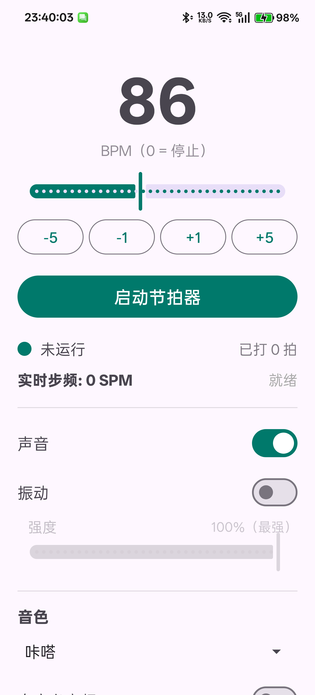

# 跑步节拍器 (Running Metronome)

专为跑者步频控制与节奏训练设计的轻量级、离线 Android 节拍器应用。

<p align="center">
  
</p>

---

## 🌟 核心特性（v2.0）

- **采样时钟驱动的节拍**：
  - 节拍由 `AudioTrack` 的 PCM 采样帧定位（48kHz，双耳/立体声输出），每拍按
    流内绝对帧号精确落点，不依赖 Handler 定时；间隔与音频硬件时钟对齐，
    设计上避免逐拍定时器的累积漂移。实际真机计数与间隔以测试日志为准。
- **训练会话**：
  - 明确的会话状态（准备中/训练中/已暂停/已完成/错误）；暂停冻结计时且
    保留进度，停止才清空；前台服务持有会话，息屏、切走后持续运行。
  - 定时训练与分段训练两个独立开关：普通正计时 / 定时结束 / 分段计划 /
    分段+定时硬上限。分段支持"只循环指定连续段"（热身、冷身各一次）、
    每段独立时长与目标步频、准备倒计时（不计入训练时长）。
  - 训练进度由可测试的单调时钟状态模型推导（`core/` 纯 Kotlin，JVM 单元
    测试覆盖），长间隔调度后一次评估即可跨多段正确定位。
- **左右脚独立音色**：
  - 左右脚可分别选择内置音色或各自导入自定义音频；支持居中（双耳，默认）
    与左右声道交替两种模式；交替顺序会话内确定（左脚先），暂停/恢复保留。
  - 自定义音频以稳定资源 id 存入 App 私有目录，重启后仍可用；导入有
    加载中/成功/失败状态，失败时明确提示并回退内置音色。
- **节拍独立音量与试听**：
  - 节拍音量独立于系统媒体音量（音乐音量不受影响）；任意音色/自定义音频
    可试听，试听走与正式播放相同的音色解析、音量与最终化处理，不改会话、
    不计拍数、播完自动释放资源。
- **掉速报警（响应优先）**：
  - 检测与报警独立开关；报警基于"累计偏慢"模型（持续慢于目标-余量累计
    达到配置时长触发，死区冻结不清零，恢复确认后解除）。
  - 步频估计使用最近 3 个步间隔的中位数（浮点、无截断偏差），步频阶跃后
    2~3 个新间隔内跟随新值（旧版 10 步平均窗口需 ~9 个间隔）。
  - 报警解除有独立确认 deadline：恢复条件达成 600ms（可调）即解除并停止
    后续短提示，不等下一步点、不等下一轮提示周期。
  - 默认报警方式为"保留节拍 + 间隔叠加短提示"，可选长音模式（替代节拍）。
  - 报警事件时间与处理时间分离，迟到/批量步点不误判；无数据、无权限、
    无传感器绝不误报。
- **与音乐共存**：
  - 节拍以 `AUDIOFOCUS_GAIN_TRANSIENT_MAY_DUCK` 申请焦点：支持 duck 的
    播放器整体压低音量、不被暂停；节拍停止/暂停/声音关闭后音乐恢复。
  - 焦点被临时中断时明确显示"声音被中断"（训练计时不受影响）；被永久
    抢占时静音并提供恢复入口，不自动反复抢焦点。
  - 注：压低与否由系统和其他播放器决定，本 App 不能强制控制其他应用音量。
- **通知栏与锁屏控制**：
  - 通知提供暂停/继续、停止、±5 SPM；MediaSession 统一同一套会话命令，
    系统/锁屏媒体控制的播放/暂停/停止真实生效。
- **命名预设**：
  - 完整配置（步频、音量、双脚音色与资源、振动、报警、训练计划）可保存
    为命名预设，支持新增/改名(通过重建)/应用/更新/删除；应用预设不启动
    训练、不清空运行中会话。
- **触觉反馈**：
  - 振动开关与强度调节（支持振幅控制的设备映射振幅，否则脉宽/双脉冲）。

---

## 📱 运行环境与机型验证

- **最低支持**：Android 8.0 (API 26) 及以上
- **推荐系统**：Android 14 / Android 15
- **本次真机**：OnePlus 13（PJZ110，Android 15 / ColorOS 15）

2026-10-09 在 OnePlus 13 上已复测左右脚各自通过 SAF 导入 WAV（`left-softbell.wav`
和 `right-wood.wav`），重启 App 后两份资源仍显示且启用；命名预设的新增、改名、
更新、应用、删除入口已在真机操作。修正测试样本生成器的 WAV 头部后，导入才成功；
旧样本的失败不能归因于正式解析器。最终代码已完成 **107 个 JVM 测试
（0 失败、0 跳过）、`lintDebug`、debug/release APK 构建**，日志见
`D:\APK\running-metronome_Data\real-device-20261009\gradle-final-build.log`，验证记录见
`D:\APK\running-metronome_Data\real-device-20261009\验证报告.md`。

最终 debug APK 安装后的 `test_metronome.sh all` 在 OnePlus 13 上退出码为 0：
120 SPM 的 60 秒窗口 120 拍，息屏 30 秒 60 拍，注入报警、定时分段、受控
播放器焦点与五次启停用例均通过。报警日志记录慢速累计起点后 5,001 ms
进入报警，再过 92 ms 提交短提示 PCM；恢复确认起点后 601 ms 解除报警，
再过 36 ms 提交淡出 PCM。这些是 AudioTrack 写入/提交时间，不代表实际
可闻时间。相同理想合成输入的离线对照为旧版/修复版触发 6,125/5,750 ms、
解除 3,473/1,863 ms，均保留原 5,000/600 ms 配置等待；固定合成抖动下
修复版也不再卡在报警状态。对照文件位于
`D:\APK\running-metronome_Data\real-device-20261009\cadence-comparison\离线步频报警对比.md`。
真实跑步传感器投递与报警端到端响应、ColorOS 长时间息屏、蓝牙双耳链路
与路由切换、真实音乐 App 的压低行为，以及扬声器或耳机的主观听感仍未验证，
见《真机测试指南》。

---

## 🛠️ 构建与安装

```bash
# JVM 单元测试（核心逻辑：估计器/状态机/时间线/混音/渲染/编解码）
./gradlew.bat testDebugUnitTest

# 编译 APK
./gradlew.bat assembleDebug assembleRelease

# 安装到连接的设备
adb install -r app/build/outputs/apk/debug/app-debug.apk
```

---

## 📂 架构概览

```text
com.metronome.app/
├── core/                    # 纯 Kotlin 核心（无 Android 依赖，JVM 可测试）
│   ├── TrainingCore.kt      #   训练计划模型 + 时间线定位（分段/循环/上限）
│   ├── SessionCore.kt       #   会话状态机（准备/运行/暂停/完成，注入时钟）
│   ├── CadenceCore.kt       #   步频估计器 + 检测/报警状态机
│   ├── BlockRenderer.kt     #   10ms 块渲染：双脚音色/声道/报警提示/门控/限幅
│   ├── PcmMixer.kt          #   跨块宽位混音器（组淡出）
│   └── Codecs.kt            #   预设/训练配置序列化
├── MainActivity.kt          # 界面：目标/检测/双脚音色/报警/训练/预设
├── MetronomeService.kt      # 前台服务：控制线程 + 音频线程 + 振动线程
├── MetronomeEngine.kt       # 全局设置与状态单例（持久化/迁移/预设）
├── StepTracker.kt           # 传感器接入层（统一检测快照发布、debug 注入）
├── SoundBank.kt             # 内置音色合成 + 自定义解码 + 私有资源存储
├── AudioImporter.kt         # 导入管线（请求序号/加载状态/旧版迁移）
└── PreviewManager.kt        # 试听播放器（与正式播放同一处理路径）
```

### 线程与职责

- `metronome-ctl`（控制线程）：会话命令、音频焦点、通知、MediaSession、
  会话计时 tick 全部串行于此；焦点 API 不在音频线程调用。
- `metronome-clock`（音频线程）：持有 AudioTrack 生命周期，逐块渲染写入；
  以实际写入帧数推进内容时间线；部分写入保留重写；可恢复错误有限次重建。
- `metronome-vib`（振动线程）：marker 回调驱动振动与计数，与听感对齐。

---

## 📄 开源许可

本项目遵循 MIT 协议开源。

## 🙏 参考与致谢

本次实现参考下列固定版本的源码，相关设计均在本仓库用 Kotlin 实现；
未移入这些项目的源码或采样文件：

- [GOTronome `StrikePool.h` 的 `strike()`/`renderPool()`](https://github.com/depasca/GOTronome/blob/e22d28dca85590f331fc1ade10039ec7bdeb89d3/app/src/main/cpp/StrikePool.h)
  （MIT）：参考声部跨块延续与尾音处理，落实在本项目 `PcmMixer`/`BlockRenderer`。
- [TimeR Machine `StepEntity.Group`](https://github.com/timer-machine/timer-machine-android/blob/54c64d18d3cc8da03dac0416510e0c189c5e1572/domain/src/main/java/xyz/aprildown/timer/domain/entities/StepEntity.kt)
  （GPL-3.0）：仅参考“多段组成一个循环组”的建模思路，`TrainingCore` 是独立实现，未复制 GPL 代码。
- [Metronome-Android `MainActivity.addBookmark()`](https://github.com/fennifith/Metronome-Android/blob/518353ab1e0a054ff4c59a6f3cd530610104f5b6/app/src/main/java/james/metronome/activities/MainActivity.java)
  （Apache-2.0）：参考常用 BPM 的保存交互；本项目自行实现可命名的完整配置预设。
- [RunningCadence `VoiceFeedback.calculateFeedbackInterval()`](https://github.com/aleung/RunningCadence/blob/95901d2550cbcc09298b3ac74ee67a087d777980/RunningCadence/src/leoliang/runningcadence/VoiceFeedback.java)
  （Apache-2.0）：用作旧式慢速提醒间隔的反例，未复用实现。
